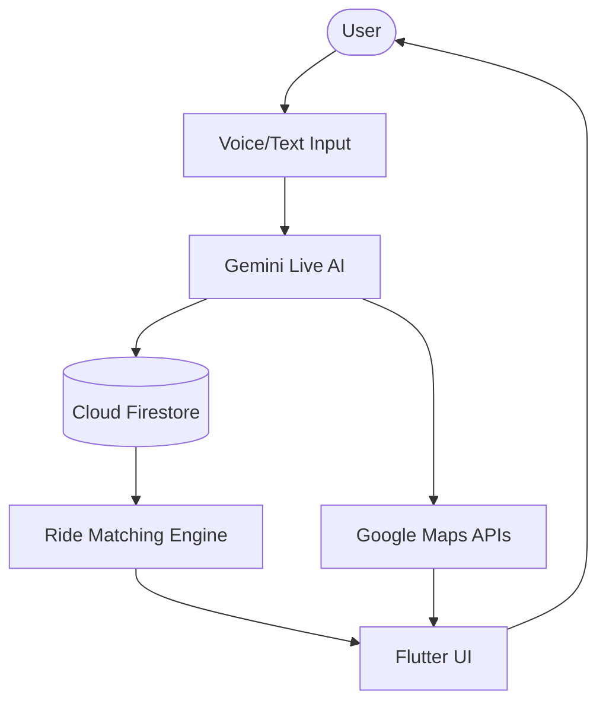

# 🚗 CoRides.ai — AI-Powered Community Mobility Platform Built for #AISeekho 2026 - Challenge Submission

[](https://flutter.dev)
[](https://firebase.google.com)
[](https://ai.google.dev)
[](https://corides.web.app/)
[](https://corides.web.app/)

### 🌐 Official Website
https://corides.web.app/

---

> [!IMPORTANT]
> This repository is a demonstration and research-oriented implementation of an AI-assisted ride-sharing ecosystem powered by Flutter, Firebase, Google Maps, and Gemini Live AI technologies.
>
> For security reasons, API keys and Firebase credentials are excluded from the repository. You must configure your own credentials before running the project.

---

# 🇵🇰 Solving Pakistan’s Urban Mobility Crisis

Pakistan is currently facing two major transportation challenges:

- Rapidly increasing fuel prices
- Severe traffic congestion in urban areas

Daily commuting has become financially and mentally exhausting for millions of people. **CoRides.ai** is being developed as a practical AI-powered mobility solution focused on reducing transportation costs through intelligent community ride-sharing and optimized carpooling.

By enabling people traveling on similar routes to connect seamlessly, CoRides aims to:

- Reduce individual fuel expenses
- Minimize traffic load on roads
- Encourage shared transportation culture
- Improve daily commuting efficiency
- Support sustainable urban mobility in Pakistan

The vision behind CoRides is not just building another ride-booking app — it is about creating a smarter national commuting ecosystem powered by AI.

---

# 🌍 Overview

**CoRides.ai** is a next-generation AI-powered ride-sharing and community mobility platform designed to transform daily commuting into a smarter, safer, and more social experience.

Unlike traditional ride-booking applications, CoRides focuses on:

- Community-driven transportation
- Intelligent route matching
- AI-assisted booking flows
- Shared mobility optimization
- Eco-friendly commuting
- Real-time conversational interaction

The platform combines:

- 🤖 Real-time AI orchestration
- 🗺️ Smart route intelligence
- 🎙️ Voice-first interaction
- 🚘 Dynamic ride coordination
- ☁️ Cloud-native architecture

---

# 🧠 Built with the Power of Google AI & Antigravity

A significant portion of CoRides.ai was accelerated using Google’s cutting-edge AI ecosystem and experimental creative tooling powered by **Antigravity**.

## ⚡ AI-Assisted Development Workflow

Google AI tools were heavily utilized across:

- UI/UX ideation
- Rapid prototyping
- Conversational flow design
- Visual experimentation
- Frontend acceleration
- AI interaction modeling

## 🎨 From Paper Sketches to Functional UI

Early interface concepts were first sketched on paper and then transformed into modern production-ready UI components using Google Antigravity-powered workflows.

This dramatically accelerated:

- Screen design iterations
- Component generation
- Animation concepts
- Layout experimentation
- Glassmorphic interface development

## 🚀 AI-Native Product Engineering

CoRides was developed with an AI-first engineering mindset where AI was not only the product capability but also part of the actual development process itself.

This includes leveraging:

- Gemini AI for conversational orchestration
- Antigravity for creative UI acceleration
- AI-assisted frontend generation
- Rapid architecture experimentation
- AI-supported workflow optimization

The result is a highly modern, intelligent, and rapidly evolving mobility platform designed for real-world social and economic impact in Pakistan.

---

# ✨ Core Features

## 🤖 AI Ride Assistant

CoRides integrates advanced multimodal AI experiences using Gemini Live capabilities.

### Features

- Natural voice-based ride booking
- AI-powered destination extraction
- Conversational ride creation
- Real-time contextual responses
- Smart intent recognition
- Follow-up questioning for incomplete ride details

---

## 🚘 Smart Ride Matching

The system intelligently connects riders and drivers based on:

- Route similarity
- Real-time proximity
- Multi-stop optimization
- Time compatibility
- Seat availability
- Ride preferences

This enables:

- Carpooling
- Community commuting
- Partial route matching
- Reduced transportation costs

---

## 🗺️ Interactive Maps & Navigation

Integrated with Google Maps technologies for:

- Live location tracking
- Route visualization
- Pickup/drop-off mapping
- Waypoint management
- ETA estimation
- Dynamic route updates

---

## 🌱 Sustainable Mobility

CoRides promotes:

- Reduced fuel consumption
- Shared transportation
- Lower traffic congestion
- Environment-friendly commuting
- Smart urban mobility

---

## 🎙️ Voice-First Experience

A major focus of the platform is hands-free interaction.

### Voice Features

- AI-powered ride negotiation
- Real-time speech recognition
- Audio-reactive visualizer
- Low-latency conversation pipeline
- Continuous voice streaming

---

# 🎨 UI/UX Highlights

- Premium glassmorphic design
- Smooth animations & transitions
- Real-time voice visualizer
- Gradient-based modern interface
- Responsive layouts
- Mobile-first experience
- AI-reactive interactions

---

# 🏗️ Technology Stack

| Category | Technology |
|---|---|
| Framework | Flutter |
| Backend | Firebase |
| Authentication | Firebase Auth |
| Database | Cloud Firestore |
| AI Engine | Gemini Live API |
| Maps | Google Maps SDK |
| State Management | Provider |
| Voice Processing | PCM Audio Streaming |
| APIs | WebSockets + REST |
| Languages | Dart, JavaScript |

---

# 🧠 System Architecture



---

# 🚀 Key Platform Modules

## 👤 Authentication

- Firebase Phone Authentication
- OTP verification
- Secure login flow
- User profile management

---

## 🚗 Ride Management

- Create ride requests
- Publish ride offers
- Multi-stop rides
- Ride history
- Ride status tracking

---

## 💬 AI Communication

- AI chat interface
- Voice conversations
- Context-aware interactions
- Message persistence

---

## 📍 Location Services

- GPS location access
- Reverse geocoding
- Route calculations
- Nearby ride discovery

---

# 📂 Project Structure

```bash
lib/
├── main.dart
├── models/
├── screens/
├── services/
├── widgets/
├── logic/
├── providers/
├── utils/
└── firebase_options.dart
```

---

# 🔥 Firebase Collections

## users

```json
{
  "uid": "string",
  "name": "string",
  "phone": "string",
  "role": "rider | driver",
  "created_at": "timestamp"
}
```

---

## rides

```json
{
  "ride_id": "string",
  "creator_id": "string",
  "origin": {},
  "destination": {},
  "departure_time": "timestamp",
  "status": "pending | ongoing | completed",
  "available_seats": 3
}
```

---

## messages

```json
{
  "message_id": "string",
  "user_id": "string",
  "content": "string",
  "timestamp": "timestamp"
}
```

---

# ⚡ AI Booking Workflow

## Ride Creation Flow

1. User starts voice interaction
2. AI extracts:
   - Pickup location
   - Destination
   - Time
   - Preferences
3. AI validates missing details
4. Ride is created in Firestore
5. Matching engine finds compatible rides
6. User receives ride suggestions

---

# 🔒 Security

- Firebase Authentication
- Protected Firestore rules
- Secure API management
- Permission-controlled location access
- Sensitive credentials excluded from repository

---

# 📦 Installation

## Prerequisites

- Flutter SDK 3.10+
- Firebase account
- Google Cloud account
- Android Studio / VS Code
- Google Maps API key
- Gemini API key

---

## Clone Repository

```bash
git clone https://github.com/faisal-ismail/CoridesLive.git
cd CoridesLive
```

---

## Install Dependencies

```bash
flutter pub get
```

---

## Firebase Setup

1. Create Firebase project
2. Enable:
   - Authentication
   - Cloud Firestore
3. Add:
   - `google-services.json`
   - `GoogleService-Info.plist`

Run:

```bash
flutterfire configure
```

---

## Configure API Keys

Create:

```bash
lib/constants.dart
```

Add:

```dart
class AppConstants {
  static const String geminiApiKey = 'YOUR_GEMINI_API_KEY';
  static const String googleMapsApiKey = 'YOUR_GOOGLE_MAPS_KEY';
}
```

---

## Run Application

```bash
flutter run
```

---

# 📸 Platform Preview

## AI-Powered Community Mobility

- Voice-assisted booking
- Smart ride orchestration
- Interactive maps
- Community-driven transportation
- Real-time AI interactions

---

# 🚧 Future Roadmap

- [ ] AI fare prediction
- [ ] Driver verification
- [ ] Digital payments integration
- [ ] Advanced carpool optimization
- [ ] Ride analytics dashboard
- [ ] Smart city integrations
- [ ] EV ride support
- [ ] AI safety monitoring

---

# 🤝 Contributing

Contributions are welcome.

Feel free to:

- Open issues
- Submit pull requests
- Improve documentation
- Add new features

---

# 👨‍💻 Developer

Developed by Faisal Ismail

- Portfolio: https://sineix.com/faisal
- GitHub: https://github.com/faisal-ismail

---

# 🙏 Acknowledgments

Special thanks to:

- Flutter
- Firebase
- Google AI Studio
- Google Maps Platform
- Gemini Live API
- Google Antigravity

---

# 🚀 CoRides.ai

### Building the future of intelligent, community-driven mobility for Pakistan and beyond.
