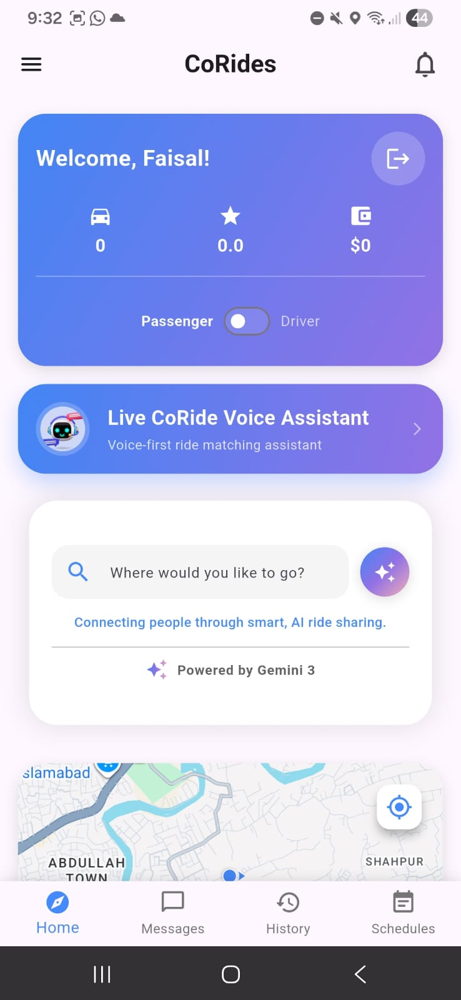
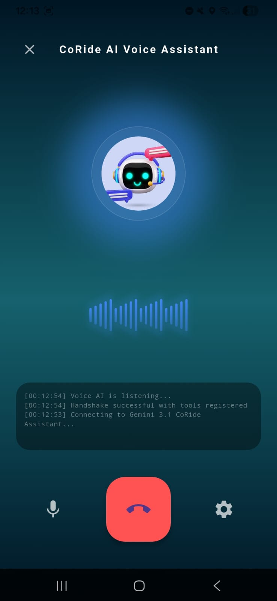
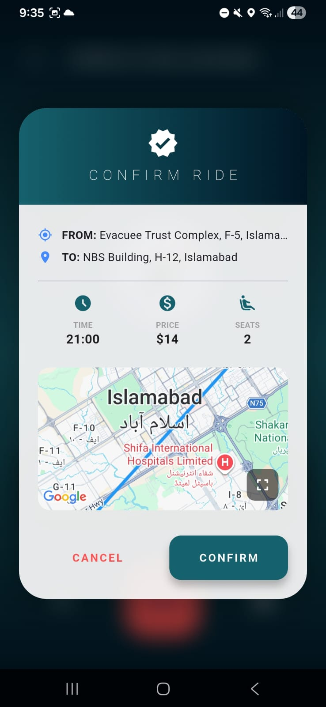
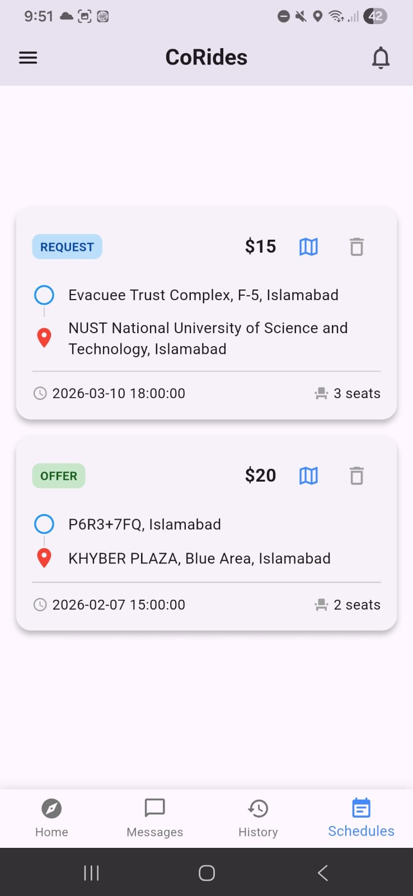
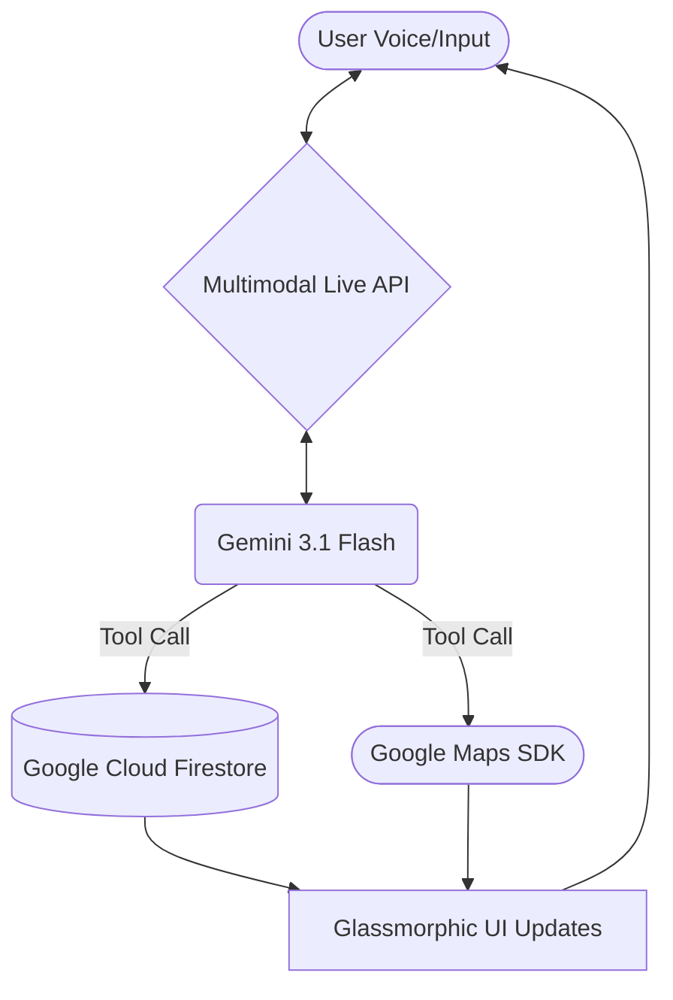

# 🚗 CoRides.ai - Intelligent Community Ride-Sharing

[](https://flutter.dev)
[](https://firebase.google.com)
[](https://ai.google.dev)
[](https://corideswithgemini.sineix.com/)
[](https://corideswithgemini.sineix.com/#download)

> [!CAUTION]
> **Important Security & Setup Notice**: This repository was recently re-uploaded due to the accidental exposure of private API keys. To ensure the application functions correctly, **you must generate your own personal API keys** for Google Maps (via **Google Cloud Console**) and **Gemini AI** (via Google AI Studio). See the [Installation](#installation) section for details.

### 🌐 [Official Website](https://corideswithgemini.sineix.com/) | 📱 [Download App](https://corideswithgemini.sineix.com/#download)

**CoRides.ai** is a revolutionary, voice-first mobility platform powered by the **Gemini 3.1 Multimodal Live API**. We turn every daily commute into a community-driven asset through real-time AI orchestration, connecting neighbors through natural conversation.

---

## 🌟 [Gemini Live Agent Challenge](https://geminiliveagentchallenge.devpost.com/) Showcase

### 💡 Inspiration
In modern urban centers, ride-sharing has become a sterile, transactional experience. We've lost the "sharing" in ride-sharing—the community connection between neighbors. **CoRides.ai** was born from the desire to make mobility more human, using AI as a conversational bridge that negotiates, connects, and builds trust through real-time natural interaction.

### 🚀 What it does
CoRides.ai is a **multimodal ride-sharing agent** where orchestration happens through natural voice. 
- **Voice-Negotiated Rides**: No complex forms—just talk to the Gemini Agent to set origin, destination, and even negotiate prices.
- **Multimodal Feedback**: A custom, speech-reactive UI that "breathes" with the AI, providing a seamless 0.5s-latency experience.
- **Community Orchestration**: Uses **Google Cloud (Firestore)** and **Gemini 3.1 Flash** to intelligently match riders and drivers based on real-time route proximity.

### 🏗️ How we built it
The platform is built on a high-performance **Flutter** frontend, leveraging the **Gemini 3.1 Flash Multimodal Live API** via persistent WebSockets for zero-latency audio interaction. We used **Google Cloud (Firestore & Auth)** as our backbone, allowing the Gemini assistant to perform real-time CRUD operations via sophisticated **Tool Calling** (Function Declarations). Audio is processed using raw **16kHz PCM buffers** for maximum efficiency on mobile hardware.

### 🧠 Challenges we ran into
- **Audio Buffer Management**: Synchronizing real-time 16kHz PCM audio across the WebSocket while maintaining a fluid UI required a custom `AudioHandler` with precise stream control.
- **Latency Optimization**: Achieving a "human" 0.5s response time required optimizing the handshake between Flutter and the Multimodal Live API, ensuring tool calls resolved in milliseconds.

### ✨ Accomplishments that we're proud of
- **True Multimodal Feel**: The app feels remarkably fluid, with the AI responding nearly as fast as a human passenger.
- **Premium Visualizer**: Developed a custom-coded, audio-reactive bar system that provides real-time multimodal feedback, making the AI feel "alive."
- **Glassmorphic Ecosystem**: Developed a high-end design language with 30px blurs and soft gradients that align with the "Premium AI" brand.

### 📚 What we learned
Building with the **Multimodal Live API** taught us that the future of UI isn't in buttons, but in **invisible orchestration**. When the AI can "hear" and "act" simultaneously, the traditional boundaries of app development disappear.

### 🔮 What's next for CoRides.ai
We aim to integrate real-time payment gateways directly into the voice flow and expand our route optimization algorithms to support complex, multi-stop carpooling for entire urban communities.

---

---

### 🤖 **Cutting-Edge AI Orchestration**
- **Gemini 3.1 Flash (Multimodal Live)**: Real-time, low-latency voice interaction via native Multimodal Live WebSockets.
- **Speech-Reactive Visualizer**: A dynamic, audio-reactive voice bars animation providing live feedback of user and AI audio levels.
- **Smart Slot-Filling**: AI extracts origin, destination, time, and price directly from natural conversations.
- **Intelligent Matching**: Real-time multi-stop route optimization for seamless driver-rider pairing.

### 🎨 **Premium UI/UX Design**
- **Glassmorphic Aesthetic**: High-end interface featuring soft blurs, vibrant gradients (Teal & Midnight Blue), and premium shadowing.
- **Fluid Transitions**: Modern navigation using `AnimatedCrossFade` and custom micro-animations.
- **Interactive Maps**: Full-screen **Google Maps** integration for real-time location tracking and route visualization.
- **Multi-Stop Routes**: Dynamic waypoint management for optimized passenger pickups.

---

## 🎬 Demo Video

[Watch CoRides in Action on Vimeo](https://vimeo.com/1174200831)

---

## 📸 App Gallery

<p align="center">
  
  
  
  
</p>

---

### 💬 **Communication**
- **AI Chat Interface**: Full-featured chat with Gemini AI using Flutter AI Toolkit
- **Message History**: Complete conversation logs for all interactions
- **Context Awareness**: AI remembers conversation context for seamless booking

### 🔐 **Authentication**
- **Firebase Phone Auth**: Secure OTP-based authentication
- **User Profiles**: Separate rider and driver roles
- **Cloud Firestore**: Real-time data synchronization

---

## 🛠️ Technology Stack

| Category | Technology |
|----------|-----------|
| **Framework** | Flutter 3.10+ |
| **Backend** | **Firebase** (Auth, Firestore, Cloud Functions) |
| **AI Engine** | **Google Gemini 3.1 Flash** (Multimodal Live API) |
| **Maps & Location** | **Google Cloud Console** (Maps SDK, Places API, Geocoding) |
| **Voice Processing** | Flutter PCM Sound & Multimodal WebSockets |
| **State Management** | Provider |
| **Languages** | Dart, Node.js/Python (Cloud Functions) |

---

---

## 🚀 Getting Started

### Prerequisites

- Flutter SDK 3.10 or higher
- Dart SDK
- Firebase CLI
- Google Cloud Platform account (for Gemini API)
- Android Studio / Xcode (for mobile development)

### Installation

1. **Clone the repository**
   ```bash
   git clone https://github.com/faisal-ismail/corides.git
   cd corides
   ```

2. **Install dependencies**
   ```bash
   flutter pub get
   ```

3. **Configure Firebase**
   - Create a Firebase project at [Firebase Console](https://console.firebase.google.com)
   - Enable Phone Authentication
   - Enable Cloud Firestore
   - Download and add configuration files:
     - `google-services.json` (Android) → Place in `android/app/`
     - `GoogleService-Info.plist` (iOS) → Place in `ios/Runner/`
   - **Note:** These files are in `.gitignore` for security—do not commit them
   - Run FlutterFire CLI:
     ```bash
     flutterfire configure
     ```

4. **Set up Gemini API**
   - Get your API key from [Google AI Studio](https://makersuite.google.com/app/apikey)
   - Create `lib/constants.dart` with:
     ```dart
     class AppConstants {
       static const String geminiApiKey = 'YOUR_API_KEY_HERE';
       static const String googleMapsApiKey = 'YOUR_MAPS_API_KEY_HERE';
     }
     ```
   - **Note:** `lib/constants.dart` is in `.gitignore` for security—do not commit it

5. **Configure Google Maps**
   - Enable Maps SDK for Android/iOS in Google Cloud Console
   - Add API keys to:
     - `android/app/src/main/AndroidManifest.xml`
     - `ios/Runner/AppDelegate.swift`

6. **Run the app**
   ```bash
   flutter run
   ```

---

## 📂 Project Structure

```
lib/
├── main.dart                 # App entry point & home screen
├── constants.dart            # API keys and constants
├── firebase_options.dart     # Firebase configuration
├── models/                   # Data models
│   ├── ride.dart
│   ├── user.dart
│   └── message.dart
├── screens/                  # UI screens
│   ├── gemini_chat_screen.dart
│   ├── gemini_live_voice_screen.dart
│   └── ...
├── services/                 # Business logic
│   ├── auth_service.dart
│   ├── gemini_service.dart
│   ├── firestore_service.dart
│   └── location_service.dart
├── widgets/                  # Reusable components
└── logic/                    # App logic
```

---

## 🔥 Firebase Collections

### `users`
```javascript
{
  uid: String,
  phone_number: String,
  role: 'rider' | 'driver',
  created_at: Timestamp
}
```

### `rides`
```javascript
{
  ride_id: String,
  creator_id: String,
  type: 'request' | 'offer',
  origin: { geopoint: GeoPoint, address: String },
  destination: { geopoint: GeoPoint, address: String },
  waypoints: [GeoPoint],
  departure_time: Timestamp,
  status: 'pending' | 'matched' | 'ongoing' | 'completed' | 'cancelled',
  negotiated_price: Number,
  seats_available: Number
}
```

### `messages`
```javascript
{
  message_id: String,
  user_id: String,
  timestamp: Timestamp,
  is_user_message: Boolean,
  content: String,
  intent_extracted: Object
}
```

---

## 🛠️ Technical Architecture



The app uses a **BidiGenerateContent** WebSocket connection to stream 16kHz PCM audio. The Gemini model uses **Function Calling** to interact with our Firestore backend in real-time, allowing it to "see" and "act" on the database while maintaining a continuous voice conversation with the user.

---

## 🎯 Core Features Implementation

### AI-Assisted Booking Flow

1. **User Interaction**: User taps the Gemini FAB button
2. **Voice/Text Input**: User speaks or types their ride request
3. **Slot Filling**: Gemini AI extracts:
   - Origin location
   - Destination location
   - Departure time
   - Price preference
4. **Validation**: AI asks follow-up questions for missing information
5. **Confirmation**: Once complete, ride request is created in Firestore
6. **Matching**: Cloud Functions match riders with nearby drivers

### Multi-Stop Route Matching

- Drivers set origin, destination, and waypoints
- Algorithm checks if rider's route is within 2km of driver's polyline
- Results sorted by price and proximity
- Real-time updates as drivers accept/decline

---

## 📦 Key Dependencies

```yaml
dependencies:
  flutter_sdk: flutter
  firebase_core: ^4.4.0
  firebase_auth: ^6.1.4
  cloud_firestore: ^6.1.2
  google_generative_ai: ^0.4.7
  google_maps_flutter: ^2.14.0
  geolocator: ^14.0.2
  geocoding: ^3.0.0
  flutter_ai_toolkit: ^1.0.0
  firebase_ai: ^3.7.0
  speech_to_text: ^7.3.0
  flutter_tts: ^4.2.5
  provider: ^6.1.5
  http: ^1.2.1
```

---

## 🎨 UI/UX Highlights

- **Material 3 / Glassmorphism**: Modern, clean, and high-end interface.
- **Interactive Map**: Full-screen Google Maps integration.
- **Speech-Reactive Visualizer**: Live voice feedback in the assistant screen.
- **Premium Animations**: Smooth `AnimatedCrossFade` transitions between UI states.
- **Gradient Actions**: Primary branding with deep Teal & Midnight Blue gradients.

---

## 🔒 Security & Privacy

- Phone number authentication via Firebase
- Secure API key management
- Firestore security rules for data protection
- Location permissions handled properly

---

## 🧪 Testing

```bash
# Run all tests
flutter test

# Run with coverage
flutter test --coverage
```

---

## 🚧 Roadmap

- [ ] Real payment gateway integration
- [ ] Driver verification system
- [ ] Ride rating and reviews
- [ ] Push notifications
- [ ] In-app messaging between riders and drivers
- [ ] Advanced route optimization
- [ ] Carpooling for multiple riders

---

## 🤝 Contributing

This is a public open-source project. Contributions are welcome! Please feel free to submit pull requests and issues.

---


---

## 👨‍💻 Developer

Developed with ❤️ using Flutter and powered by Google Gemini AI

---

## 📞 Support

For issues and questions, please contact the development team.

---

## 🙏 Acknowledgments

- **Google Gemini AI** for advanced natural language processing
- **Firebase** for backend infrastructure
- **Flutter** for cross-platform development
- **Google Maps** for mapping services

---

**Powered by Gemini AI** 🚀
